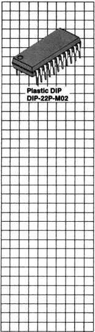

Advanced Products

FUJITSU

# ■ MB88303

NMOS Television Display Controller (TVDC)

October 1986

Edition 2.0

# Description

The Fujitsu MB88303 NMOS Television Display Controller (TVDC) is an interface LSI that displays 180 alphanumeric characters (20 characters x 9 lines) in white on a TV screen. The characters overlay the picture on the TV screen.

While designed to operate in conjunction with the Fujitsu MB8840/8850 and MB88400/88500 single-chip 4-bit microcomputers, the MB88303 TVDC can also be interfaced to a wide range of 4- and 8-bit microprocessors.

The MB88303 allows simple interface to almost any TV display (raster scan CRT with horizontal and vertical scanning) regardless of interlace or non-interlace scan.

The MB88303 is fabricated with N-channel silicon-gate E/D MOS process, and packaged in a 22-pin plastic DIP. Also, it is powered by a single +5V power supply, and operates over a temperature range of -30°C to +70°C.

# Features

- Character display controller available for NTSC, PAL and SECAN TV sets
- 20 character x 9-line screen format (Max. 180 characters/screen)
- 5x7-dot matrix character format (1-dot horizontal and 2-dot vertical spacings)
- 64-character set
- Programmable character size: 4 widths and 4 heights
- Programmable display start position: 57 horizontal and 64 vertical positions
- Programmable character blinking control

- Automatic inter-dot filling function for improved smoothness
- Black-level background output for improved clarity
- 180 x 7-bit display data RAM
- 448 x 5-bit character generator ROM
- Four control registers
- 3-bit general-purpose open-drain latched output
- On-chip clock generator for external RC-network
- Single +5V power supply
- Wide operating temperature range: -30°C to +70°C
- N-channel silicon-gate E/D MOS process
- 22-pin plastic DIP (Suffix -P)

4-81

4