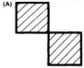
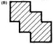
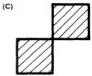
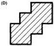
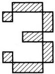
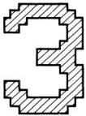

MB88303

# Functional Description
(Continued)

# Display Starting Position
Control

The horizontal and vertical
display starting points on the
TV screen are determined by
specifying the position at
which the black background
display begins. This is done
with the values of addresses
HP5 to HP0 and VP5 to VP0
as shown in Fig. 6 and Fig. 7.

The horizontal starting position
HS and the vertical start
position VS may be found
using the following equations:

HS = T × 4 [2⁵ × HP5 + 2⁴ ×
HP4 + 2³ × HP3 + 2² × HP2²
+ 2 × HP1 + HP0) + P]

VS = H × 4 (2⁵ × VP5 + 2⁴ ×
VP4 + 2³ × VP3 + 2² × VP2 + 2 ×
VP1 + VP0)

where: P = width of character,
from Table 4;
T = 1/fc [fc = oscillating
frequency; 6MHz typ.]
H = period of horizontal
synchronization signal
[63.5μs typ.]

# Blinking Control

The MB88303 supports
blinking of any desired
character(s) on the screen.
Blinking affects only those
characters for which the
blinking bit is set to 1. Display
is on for approximately 0.5s
and off for the same period
(vertical synchronization
pulse x 64).

Table 4. P Values

|  HSZ1 | HSZ0 | P  |
| --- | --- | --- |
|  0 | 0 | 9  |
|  0 | 1 | 10  |
|  1 | 0 | 11  |
|  1 | 1 | 12  |

Figure 12(a). Dot Filling Examples

INTERNAL DOT PATTERN

DISPLAY DOT PATTERN

Figure 12(b). Simple 5×7 Matrix [Left] &
with "Filling" Function [Right]

Blinking can be set as follows:

1. Set the blinking enable bit of the display control register to 1.
2. Set the blink control bit to 1 for the position of the display memory corresponding to the character for which blinking is desired.

# "Filling" Function

"Filling" is the process
whereby dot matrix displays
like those in (A) of Fig. 12(a) 's,
are filled out to the form
shown in (B) by the display of
an intermediate dot. As can be
seen from Fig. 12(b) "filling"
results in a smoother and
more pleasing shape than
can be attained with an
ordinary 5 x 7-dot matrix.

FUJITSU

4-90