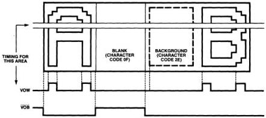
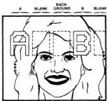
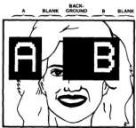
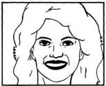

MB88303

# Functional Description
(Continued)

# Display Output Timing

Fig 13. shows the timing for
VOW and VOB for the
overlayed portion of a display
consisting of the letter "A", a
"blank" (character code 0F),
"background" (character
code 2E), and the letter "B",
with the display blinking and
background blanking set to 1.

Note that the display of the
background changes during
the "BLANK" character when
the VOB line goes high.

# Difference Between Blanks
and Background

Note: In Fig. 14(b) which
shows a screen of characters
overlaying the picture of a

woman, a blank (character
code 0F) displays differently
from background (character
code 2E), depending on
whether VOB is used or not.

In Fig. 14(b) both pictures
display the letter "A", a
"blank", a "background", the
letter "B", and a "blank".

In the right picture of Fig.
14(b), where VOB is on, the
character displays are
bounded by a black frame, so
that the spaces between
characters display as black.
Where a blank is displayed, a
5 x 7-dot portion of the TV
picture is visible. The

background display is
black.

In the left picture of Fig.
14(b), were VOB is off, the TV
picture is visible everywhere
on the screen except where
the characters display in
white. Here, blanks and
background are displayed
identically. Note that the
broken lines have been drawn
in to indicate where the
frames would be displayed if
they were displayed on the
screen.

Figure 13. Display Output Timing

Fig 14(a). Display of
TV Picture

Fig 14(b). Display of Character on TV Picture

• VOB OFF

• VOB ON

# Notes:

1. For HSYNC and VSYNC input signals, both cycle and rise/fall times must be constant.
2. Character output during the blanking period of TV should be inhibited. If not, character shapes may change. So, blanks should be written for memory addresses which cannot be displayed on the screen.

FUJITSU

4-91

4