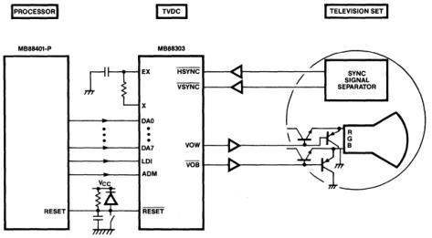

MB88303

Functional Description
(Continued)

Figure 15. Application Example

Absolute Maximum
Ratings

|  Parameter | Symbol | Pin | Rating | Unit  |
| --- | --- | --- | --- | --- |
|  Supply Voltage | V_{CC} | V_{CC} | V_{SS} -0.3 to V_{SS} +7.0 | V  |
|  Input Voltage | V_{IN} | EX, RESET, ADM, LDI, DA7-DA0 | V_{SS} -0.3 to V_{SS} +7.0 | V  |
|  Output Voltage | V_{OUT} | VOW, VOB | V_{SS} -0.3 to V_{SS} +7.0 | V  |
|   |   |  DO0-DO2 | V_{SS} -0.3 to V_{SS} +15  |   |
|  Operating Temperature | T_{A} |  | -30 to +70 | °C  |
|  Storage Temperature | T_{stg} |  | -55 to +150 | °C  |
|  Power Dissipation | P_{D} |  | 600 | mW  |

Note: Permanent device damage may occur if ABSOLUTE MAXIMUM RATINGS are exceeded. Functional operation should be restricted to the conditions as detailed in the operational sections of this data sheet. Exposure to absolute maximum rating conditions for extended periods may affect device reliability.

FUJITSU

4-92