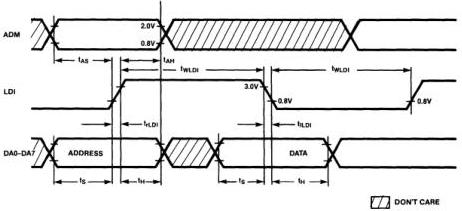
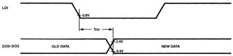

MB88303

# AC Characteristics

(Recommended operating conditions unless otherwise noted.)

|  Parameter | Symbol | Pin | Value |   | Unit | Condition  |
| --- | --- | --- | --- | --- | --- | --- |
|   |   |   |  Min. | Max.  |   |   |
|  LDI Pulse Width | t_{WLDI} | LDI | 5 |  | μs | Fig. 15, Fig. 18  |
|  LDI Rise/Fall Time | t_{FLDI} t_{FLDI} | LDI |  | 1 | μs | Fig. 15, Fig. 18  |
|  ADM Setup Time | t_{AS} | ADM | 0.5 |  | μs | Fig. 15, Fig. 18  |
|  ADM Hold Time | t_{AH} | ADM | 2 |  | μs | Fig. 15, Fig. 18  |
|  Address/Data Setup Time | t_{S} | DA0 to DA7 | 0.5 |  | μs | Fig. 15, Fig. 18  |
|  Address/Data Hold Time | t_{H} | DA0 to DA7 | 2 |  | μs | Fig. 15, Fig. 18  |
|  DO Output Delay Time | t_{DD} | DO0 to DO2 |  | 0.6 | μs | Fig. 16, Fig. 18  |
|  RESET Pulse Width | t_{RST} | RESET | 4 |  | μs | Fig. 17, Fig. 18  |
|  RESET Setup Time | t_{RSTS} | RESET | 1 |  | μs | Fig. 17, Fig. 18  |
|  RESET Hold Time | t_{RSTH} | RESET | 3 |  | μs | Fig. 17, Fig. 18  |

Figure 15. Address/Data Input Timing

Figure 16. DO Output Timing

FUJITSU

4-94