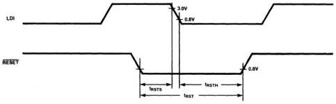
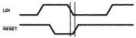
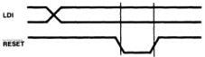
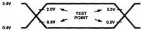
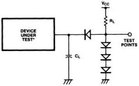

MB88303

Figure 17. RESET Input Timing

# Notes:

1. If \( t_{\text{RSTS}} \) spec. (1μs min.) is not met, the MB88303 cannot be reset.
2. If \( t_{\text{RSTH}} \) spec. (3μs min.) is not met, then the TV screen will be disturbed. This is caused by the undefined data on the DA line written into internal registers and display memory at LDI's high-to-low transition during RESET = "L". This case occurs, for example, when RESET goes high just after LDI goes low, shown at top, right diagram. This unacceptable RESET timing is caused when the device is reset separately from the processor connected to the device. However, when LDI level is fixed high or low during reset (i.e. RESET = "L") shown at bottom right diagram, the TV screen is not disturbed.

Figure 18. AC Test Conditions

# Input Conditions

# Timing Reference Levels:

3.0V for a logic "1" (RESET, LDI)
2.0V for a logic "1" (ADM, DA7-DA0)
0.8V for a logic "0"

# Output Conditions

# Timing Reference Levels:

2.4V for a logic "1"
0.4V for a logic "0"

# Output Load Circuit:

RL = 4kΩ

CL = 50pF

(including scope and jig capacitances)

*with external 5kΩ pull-up resistor at DO2-DO0 for tDD

FUJITSU

4-95

4