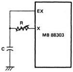

MB88303

Figure 19. RC—Network Oscillator Circuit

Note: The clock frequency (fc) has wide variation from device to device. The clock frequency also considerably depends on the ambient temperature and supply voltage.

Therefore, to limit the clock frequency within the specified range, it is required to adjust it with the external resistor in advance.

I/O Circuit Configuration

|  Pin | Type | Circuit Diagram | Characteristics  |
| --- | --- | --- | --- |
|  RESET LDI ADM DA0-DA7 HSYNC VSYNC | Input | APPROX. 500KΩ | **Pull Up Resistor:** I_{IL} ≤ 60μA at V_{CC} = 5.5V, V_{IL} = 0.4V  |
|  DO0-DO2 | Output |  | **High-Voltage Open Drain:** I_{IL} ≤ 0.4V at V_{CC} = 4.5V, V_{OL} = 1.8mA,* I_{leak} ≤ 50μA at V_{CC} = 5.5V, V_{OH} = 13.2V, OFF state,* *with external 5kΩ pull up resistor  |
|  VOW VOB | Output |  | **Pull Up Resistor:** V_{OH} ≥ 2.4V at V_{CC} = 4.5V, I_{OH} = -200μA V_{OL} ≤ 0.4V at V_{CC} = 4.5V, I_{OL} = 1.8mA  |

4-96