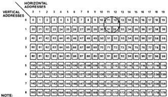
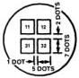
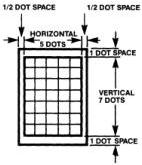

MB88303

# Functional Description

# Screen Format and Character Format

The MB88303 TVDC supports the display of 9 lines of 20 characters per line, or a total of up to 180 alphanumeric characters, as shown in Figure 1.

The characters are formed in a 5 x 7-dot matrix, with a 1-dot

space between characters and a 2-dot space between lines. Screen Format also shows the relative on-screen size of the displayed elements. Figure 2 shows the character format.

Character Patterns and Codes
The MB88303 has a built-in 5 x 7-dot matrix character

generator ROM. Fig. 6(a) shows internal character patterns in the character generator, which are automatically modified by "filling" function and displayed on the screen as shown in Figure 3(b). The character patterns are encoded as shown in Table 1.

Figure 1. Screen Format

NOTE:
NUMBERS 0 to 179 INDICATE DISPLAY MEMORY ADDRESSES.

Figure 2. Character Format

Note:
Refer to Page 10 for an explanation of the difference between blanks and background.

Table 1. Character Codes

|  CH5-4  |   |   |   |   |
| --- | --- | --- | --- | --- |
|  CH3-0 | 0 | 1 | 2 | 3  |
|  0 | A | N | 0 | !  |
|  1 | B | O | 1 | ;  |
|  2 | C | P | 2 | --  |
|  3 | D | Q | 3 | --  |
|  4 | E | R | 4 | +  |
|  5 | F | S | 5 | -  |
|  6 | G | T | 6 | *  |
|  7 | H | U | 7 | /  |
|  8 | I | V | 8 | =  |
|  9 | J | W | 9 | &  |
|  A | K | X | ? | ※ (kanji)  |
|  B | L | Y | ! | 月 (kanji)  |
|  C | M | Z | (apostrophe) | B (kanji)  |
|  D | (raised dot) | : | (period) | (comma)  |
|  E | □ | ■ | □ (background) | ~  |
|  F | (blank) | [ | ] | (Telephone)  |

FUJITSU

4-85

4