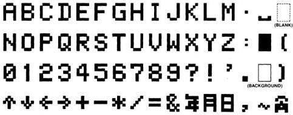
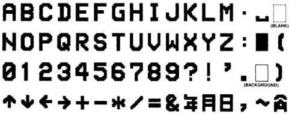

MB88303

Functional Description
(Continued)

Figure 3(a). Internal Character Dot Patterns
(Character Generator ROM Patterns)

Figure 3(b). Displayed Character Dot Patterns
(Format with "Filling" Function)

FUJITSU

4-86