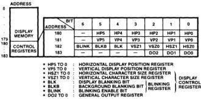
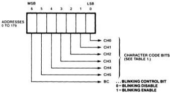
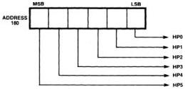
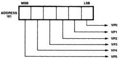

MB88303

# Functional Description
(Continued)

# Address Structure

All addresses are 8-bit words.
Addresses from 0 [00000000]
to 179 [10110011] indicate the
display memory locations.
Addresses from 180
[10110100] to 183 [10110111]
are used for the control
registers. Figure 4 shows the
memory map. Selected
addresses are input through
pins DA7 to DA0. Addresses
184 above cannot be used.

# Display Memory

The display memory is a 180 x
7-bit RAM. Bits 5 to 0 (CH5-
CH0) are character code
storage; Bit 6 (BC) can be set
to "1" to enable blinking, and
reset to zero to disable
blinking.

Figure 5 shows the word
structure; refer to Character
Codes table for character
codes (see page 5). Selected
character codes and blinking
control bit are input through
pins DA6 to DA0.

# Control Registers

# Horizontal Display Position
Register [HP5 to HP0]

This register (address 180)
stores the horizontal position
of the start of the display on the
TV screen. The values (000000)
to (000110) cannot be used for
the horizontal display position
register. Since the RESET
input clears this register, a
value must be set after every
RESET input. Figure 6 shows
the horizontal display position
register. For the display
starting position control, see
page 9.

# Vertical Display Position
Register [VP5 to VP0]

This register (address 181)
stores vertical position of the
start of the display on the TV
screen. Since the RESET
input clears this register, a
value must be set after every
RESET input. Figure 7 shows
the vertical display position
register. For the display
starting position control see
page 9.

Figure 4. Display Memory & Control Register Map

Figure 5. Display Memory Word Format

Figure 6. Horizontal Display Position Register Format

Figure 7. Vertical Display Position Register Format

FUJITSU

4-87

4