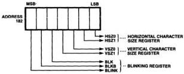
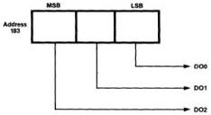
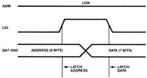

MB88303

# Functional Description
(Continued)

# Display Control Register

(1) Horizontal Character Size
Register [HSZ1 and HSZ0]

These bits indicate the width
of the characters. Character
width is selectable from 4
values determined by setting
HSZ1 and HSZ0 as shown in
Table 2. The reset input rests
both bits to zero.

Note: T is the period of
oscillation frequency Q. When
the oscillation frequency is Q
[Hz], the period at that time
T[s] is 1/Q.

(2) Vertical Character Size
Register [VSZ1 and VSZ0]

These bits indicate the height
of the characters. Character
height is selectable from 4
values by setting VSZ1 and
VSZ0 as shown in Table 3.
The reset input rests both bits
to zero.

Note: 1H (horizontal line) =
63.5μs. One screen at
non-interlace scan is 262.5H.

(3) Blinking Register [BLK,
BLKB and BLINK]

— Display Blanking Bit [BLK]

This bit indicates the status of
the characters display. When
BLK is zero, no data is
displayed; to enable display,
set BLK to "1". The reset input
resets BLK to zero.

— Background Blanking Bit
[BLKB]

This bit indicates the status of
the background display. When
BLKB is zero, background is
not displayed regardless of
data content; to enable
background display, set BLKB
to 1. The reset input resets
BLKB to zero.

— Blinking Enable Bit [BLINK]

This bit turns blinking on and
off. When BLINK is zero,
blinking is disabled regardless
of blink control bit value of the
display memory input; when
BLINK is "1", blinking is
enabled, provided that the
blink control bit of the display
memory is set to "1". The reset
input resets BLINK to zero.

Figure 8. Display Control Register Format

Table 2. Horizontal Character Size

|  Code |   | Size |   | Size  |   |
| --- | --- | --- | --- | --- | --- |
|  HSZ1 | HSZ0 | Character | Dot | Character (when Q = 6MHz, T = 167ns) | Dot  |
|  0 | 0 | 10T | 2T | 1.67μs | 0.33μs  |
|  0 | 1 | 20T | 4T | 3.34μs | 0.67μs  |
|  1 | 0 | 30T | 6T | 5.01μs | 1.0μs  |
|  1 | 1 | 40T | 8T | 6.68μs | 1.34μs  |

Table 3. Vertical Character Size

|  Code |   | Size  |   |
| --- | --- | --- | --- |
|  VSZ1 | VSZ0 | Character | Dot  |
|  0 | 0 | 14H | 2H  |
|  0 | 1 | 28H | 4H  |
|  1 | 0 | 42H | 6H  |
|  1 | 1 | 56H | 8H  |

Figure 9. General Output Register Format

Figure 10(a). Direct Address Mode Timing

FUJITSU

4-88