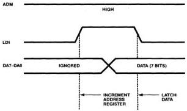
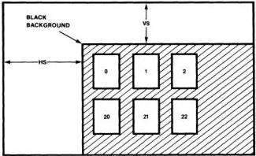

MB88303

# Functional Description
(Continued)

# General Output Register

This is a 3-bit latched output;
data written to DO2 to DO0 is
output to the open drain
terminals DO2 to DO0. The
reset input sets DO2 to DO0
lines to "1".

# Data Input

MB88303 has two modes for
writing data to the control
registers and display memory.
The modes are switched by the
ADM input.

# Direct Address Mode

This mode is enabled when
input to the ADM terminal is
low. When the input signal to
the LDI terminal goes high,
data on DA7 to DA0 are
latched to the address
register. When the LDI
terminal signal goes low,
7 bits of data, DA6 to DA0,
are written to the memory
specified by the memory
address register. Fig. 10(a) is
the timing diagram.

# Address Increment Mode

This mode is enabled when
input to the ADM terminal is
high. When the input signal
to the LDI terminal goes high,
the data currently latched to
the address register are
incremented. When the LDI
terminal signal goes low, 7 bits
of data, DA6 to DA0, are
written to the memory
specified by the address
register after incrementing.
Fig. 10(b) is the timing
diagram.

# Reset

1. The following internal
registers are cleared by
RESET.

Horizontal character size
register: HSZ1 = HSZ0 = "0"

Horizontal display position
register:
HP5 to HP0 = "0"

Vertical character size register:
VSZ1 = VSZ0 = "0"

Vertical display position
register:
VP5 to VP0 = "0"

Blinking register: BLINK =
BLKB = BLK = "0"

Figure 10(b). Address Increment Mode Timing

Figure 11. Display Start Position

Note: If T(s) is the period when the oscillating frequency
is fc (Hz), H will be equal to one period of the horizontal
synchronization signal.

2. General output register
(DO outputs) is set by
RESET.
DO2 = DO1 = DO0 = "1" ("H")

3. VOW and VOB outputs are
initialized by RESET as
follows:

VOW = "L", VOB = "H" (Blanks
are displayed on the screen.)

No character is displayed on
the TV screen until "BLK" bit
(Bit 4 of Blinking Register) is
set to "1".

4. Address register and
Display data memory are not
affected by RESET.

FUJITSU

4-89

4